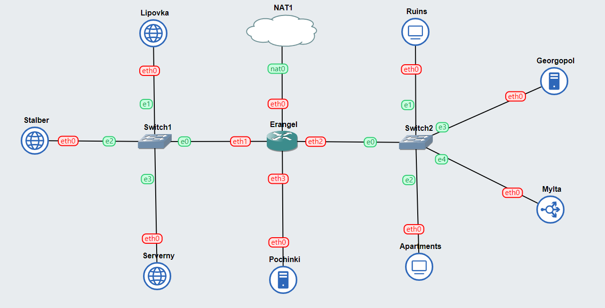

# Lapres Kelompok IT07

| Anggota           | NRP        |
| ----------------- | ---------- |
| Muhammad Afif     | 5027221032 |
| Alma Amira Dewani | 5027221054 |

## Topologi



## No.1

### GNS3 Network Configuration

- Erangel : Router

```
auto eth0
iface eth0 inet dhcp

auto eth1
iface eth1 inet static
	address 10.67.1.1
	netmask 255.255.255.0

auto eth2
iface eth2 inet static
	address 10.67.2.1
	netmask 255.255.255.0

auto eth3
iface eth3 inet static
	address 10.67.3.1
	netmask 255.255.255.0
```

- Pochinki : DNS Master

```
auto eth0
iface eth0 inet static
	address 10.67.3.2
	netmask 255.255.255.0
	gateway 10.67.3.1
        up echo nameserver 192.168.122.1 > /etc/resolv.conf
```

- Georgopol : DNS Slave

```
auto eth0
iface eth0 inet static
	address 10.67.2.2
	netmask 255.255.255.0
	gateway 10.67.2.1
        up echo nameserver 192.168.122.1 > /etc/resolv.conf
```

- Ruins : Client

```
auto eth0
iface eth0 inet static
	address 10.67.2.4
	netmask 255.255.255.0
	gateway 10.67.2.1
        up echo nameserver 192.168.122.1 > /etc/resolv.conf
```

- Apartments : Client

```
auto eth0
iface eth0 inet static
	address 10.67.2.5
	netmask 255.255.255.0
	gateway 10.67.2.1
        up echo nameserver 192.168.122.1 > /etc/resolv.conf
```

- MyIta : Load Balancer

```
auto eth0
iface eth0 inet static
	address 10.67.2.3
	netmask 255.255.255.0
	gateway 10.67.2.1
        up echo nameserver 192.168.122.1 > /etc/resolv.conf
```

- Serverny : Web Server

```
auto eth0
iface eth0 inet static
	address 10.67.1.2
	netmask 255.255.255.0
	gateway 10.67.1.1
        up echo nameserver 192.168.122.1 > /etc/resolv.conf
```

- Stalber : Web Server

```
auto eth0
iface eth0 inet static
	address 10.67.1.3
	netmask 255.255.255.0
	gateway 10.67.1.1
        up echo nameserver 192.168.122.1 > /etc/resolv.conf
```

- Lipovka : Web Server

```
auto eth0
iface eth0 inet static
	address 10.67.1.4
	netmask 255.255.255.0
	gateway 10.67.1.1
        up echo nameserver 192.168.122.1 > /etc/resolv.conf
```

### Tambahkan ini di Erangel

```
iptables -t nat -A POSTROUTING -o eth0 -j MASQUERADE -s 10.67.0.0/16
```

## No.2

### Script

- /root/script.sh

```
apt-get update
apt-get install dnsutils bind9 -y
```

### Config

- /etc/bind/named.conf.local

```
zone "airdrop.it07.com" {
        type master;
        file "/etc/bind/it07/airdrop.it07.com";
};
```

### Sebelum config DNS, selalu lakukan

```
cp /etc/bind/db.local /etc/bind/it07/name.it07.com
```

### Setelah config, restart pakai

```
service bind9 restart
```

### Config DNS

- /etc/bind/it07/airdrop.it07.com

```
;
; BIND data file for local loopback interface
;
$TTL    604800
@       IN      SOA     airdrop.it07.com. root.airdrop.it07.com. (
                              2         ; Serial
                         604800         ; Refresh
                          86400         ; Retry
                        2419200         ; Expire
                         604800 )       ; Negative Cache TTL
;
@             IN      NS      airdrop.it07.com.
@             IN      A       10.67.1.3 ; IP airdrop
www           IN      CNAME   airdrop.it07.com.
```

- Ubah nameserver client Ruins ke Pochinki

```
#nameserver 192.168.122.1
nameserver 10.67.3.2
```

- testing di Ruins

```
ping airdrop.it07.com
```

- Ubah nameserver client Apartments ke Pochinki

```
#nameserver 192.168.122.1
nameserver 10.67.3.2
```

- testing di Apartments

```
ping airdrop.it07.com
```

## No.3

Mirip No. 2 cuma beda nama

### Config DNS

- /etc/bind/named.conf.local

```
zone "redzone.it07.com" {
        type master;
        file "/etc/bind/it07/redzone.it07.com";
};
```

- /etc/bind/it07/redzone.it07.com

```
;
; BIND data file for local loopback interface
;
$TTL    604800
@       IN      SOA     redzone.it07.com. root.redzone.it07.com. (
                              2         ; Serial
                         604800         ; Refresh
                          86400         ; Retry
                        2419200         ; Expire
                         604800 )       ; Negative Cache TTL
;
@             IN      NS      redzone.it07.com.
@             IN      A       10.67.1.2 ; IP redzone
www           IN      CNAME   redzone.it07.com.
```

## No.4

Mirip No. 2 cuma beda nama

### Config DNS

- /etc/bind/named.conf.local

```
zone "loot.it07.com" {
        type master;
        file "/etc/bind/it07/loot.it07.com";
};
```

- /etc/bind/it07/loot.it07.com

```
;
; BIND data file for local loopback interface
;
$TTL    604800
@       IN      SOA     loot.it07.com. root.loot.it07.com. (
                              2         ; Serial
                         604800         ; Refresh
                          86400         ; Retry
                        2419200         ; Expire
                         604800 )       ; Negative Cache TTL
;
@             IN      NS      loot.it07.com.
@             IN      A       10.67.2.3 ; IP loot
www           IN      CNAME   loot.it07.com.
```

## No. 5

Tinggal tes dari Apartments sama Ruins

## No. 6

### Config Reverse DNS

- /etc/bind/named.conf.local

```
zone "1.67.10.in-addr.arpa" {
        type master;
        file "/etc/bind/it07/1.67.10.in-addr.arpa";
};
```

- /etc/bind/it07/1.67.10.in-addr.arpa

```
;
; BIND data file for local loopback interface
;
$TTL    604800
@       IN      SOA     redzone.it07.com. root.redzone.it07.com. (
                              2         ; Serial
                         604800         ; Refresh
                          86400         ; Retry
                        2419200         ; Expire
                         604800 )       ; Negative Cache TTL
; PTR Records
1.67.10.in-addr.arpa.    IN      NS      redzone.it07.com.
2                        IN      PTR     redzone.it07.com.
```

### Periksa melalui

```
host -t PTR 10.67.1.2
```

## No.7

- Tambahkan di semua zone /etc/bind/named.conf.local

```
notify yes;
        also-notify { 10.67.2.2; };
        allow-transfer { 10.67.2.2; };
```

Invert DNS nda usah

### Config di Georgopol

- /etc/bind/named.conf.local

```
zone "airdrop.it07.com" {
    type slave;
    masters { 10.67.3.2; };
    file "/etc/bind/it07/slave.airdrop.it07.com";
};

zone "redzone.it07.com" {
    type slave;
    masters { 10.67.3.2; };
    file "/etc/bind/it07/slave.redzone.it07.com";
};

zone "loot.it07.com" {
    type slave;
    masters { 10.67.3.2; };
    file "/etc/bind/it07/slave.loot.it07.com";
};
```

- /etc/bind/it07/slave.airdrop.it07.com

```
;
; BIND data file for local loopback interface
;
$TTL    604800
@       IN      SOA     airdrop.it07.com. root.airdrop.it07.com. (
                              2         ; Serial
                         604800         ; Refresh
                          86400         ; Retry
                        2419200         ; Expire
                         604800 )       ; Negative Cache TTL
;
@             IN      NS      airdrop.it07.com.
@             IN      A       10.67.1.3 ; IP airdrop
www           IN      CNAME   airdrop.it07.com.
```

- /etc/bind/it07/slave.redzone.it07.com

```
;
; BIND data file for local loopback interface
;
$TTL    604800
@       IN      SOA     redzone.it07.com. root.redzone.it07.com. (
                              2         ; Serial
                         604800         ; Refresh
                          86400         ; Retry
                        2419200         ; Expire
                         604800 )       ; Negative Cache TTL
;
@             IN      NS      redzone.it07.com.
@             IN      A       10.67.1.2 ; IP redzone
www           IN      CNAME   redzone.it07.com.
```

- /etc/bind/it07/slave.loot.it07.com

```
;
; BIND data file for local loopback interface
;
$TTL    604800
@       IN      SOA     loot.it07.com. root.loot.it07.com. (
                              2         ; Serial
                         604800         ; Refresh
                          86400         ; Retry
                        2419200         ; Expire
                         604800 )       ; Negative Cache TTL
;
@             IN      NS      loot.it07.com.
@             IN      A       10.67.2.3 ; IP loot
www           IN      CNAME   loot.it07.com.
```

## No.8

- tambahkan di /etc/bind/it07/airdrop.it07.com

```
medkit        IN      A       10.67.1.4
www.medkit    IN      CNAME   medkit.airdrop.it07.com.
```

## No.9

#### Di Pochinki

- tambahkan ini di /etc/bind/it07/redzone.it07.com

```
ns1           IN      A       10.67.2.2 ; IP Georgopol
siren         IN      NS      ns1
```

- tambahkan ini di /etc/bind/named.conf.options

```
allow-query{any;};
```

#### Di Georgopol

- /etc/bind/named.conf.local

```
zone "siren.redzone.it07.com" {
    type master;
    file "/etc/bind/it07/siren.redzone.it07.com";
    allow-transfer { 10.67.3.2; };
};
```

- /etc/bind/it07/siren.redzone.it07.com

```
;
; BIND data file for local loopback interface
;
$TTL    604800
@       IN      SOA     siren.redzone.it07.com. root.siren.redzone.it07.com. (
                              2         ; Serial
                         604800         ; Refresh
                          86400         ; Retry
                        2419200         ; Expire
                         604800 )       ; Negative Cache TTL
;
@       IN      NS      siren.redzone.it07.com.
; DNS Records
@           IN      A       10.67.1.2
www         IN      CNAME   siren.redzone.it07.com.
```

## No. 10

### soal

Markas juga meminta catatan kapan saja pesawat tempur tersebut menjatuhkan bom, maka buatlah subdomain baru di subdomain siren yaitu log.siren.redzone.xxxx.com serta aliasnya www.log.siren.redzone.xxxx.com yang juga mengarah ke Severny

- tambahkan ini di georgopol /etc/bind/it07/siren.redzone.it07.com

```
log         IN      A       10.67.1.2 ; IP Serverny
www.log     IN      CNAME   log.siren.redzone.it07.com.
```

### Output


## No.11

### soal

Setelah pertempuran mereda, warga Erangel dapat kembali mengakses jaringan luar, tetapi hanya warga Pochinki saja yang dapat mengakses jaringan luar secara langsung. Buatlah konfigurasi agar warga Erangel yang berada diluar Pochinki dapat mengakses jaringan luar melalui DNS Server Pochinki

- comment bagian ini di Pochinki /etc/bind/named.conf.options

```
// dnssec-validation auto;
```

- dan uncomment + atur jadi begini

```
forwarders {
    192.168.122.1;
};
```

### Output


## No.12

### Soal

Karena pusat ingin sebuah website yang ingin digunakan untuk memantau kondisi markas lainnya maka deploy lah webiste ini (cek resource yg lb) pada severny menggunakan apache

- instalasi kebutuhan

```
apt-get update
apt-get install lynx apache2 php libapache2-mod-php7.0 nginx -y
```

- masuk ke /etc/apache2/sites-available lalu copy file defaultnya

```
cp 000-default.conf jarkom-it07.conf
```

- ubah isi filenya jarkom-it07.conf

Hanya ubah bagian ini saja

```
<VirtualHost *:8080> #ubah portnya menjadi 8080

ServerAdmin webmaster@localhost
DocumentRoot /var/www/jarkom-it07 #ubah document rootnya
```

- Tambahkan port 8080 di /etc/apache2/ports,conf

```
Listen 8080
```

- Aktifkan konfigurasi

```
a2ensite jarkom-it07.conf
```

- Restart apache

```
service apache2 restart
```

- buat directory jarkom-it07 di /var/www lalu tambahkan index phpnya

```
mkdir jarkom-it07


<?php
$hostname = gethostname();
$date = date('Y-m-d H:i:s');
$php_version = phpversion();
$username = get_current_user();


echo "Hello World!<br>";
echo "Saya adalah: $username<br>";
echo "Saat ini berada di: $hostname<br>";
echo "Versi PHP yang saya gunakan: $php_version<br>";
echo "Tanggal saat ini: $date<br>";
?>
```

- jalankan

```
lynx http://10.67.1.2:8080
```

### Output


## No.13

Tapi pusat merasa tidak puas dengan performanya karena traffic yag tinggi maka pusat meminta kita memasang load balancer pada web nya, dengan Severny, Stalber, Lipovka sebagai worker dan Mylta sebagai Load Balancer menggunakan apache sebagai web server nya dan load balancernya

### Web-server

- Jalankan Keseluruhan No.12 di semua web-server (karena Serverny sudah, maka tinggal dikerjakan di Stalber dan Lipovka)

- Kemudian Jalankan Command - command ini di setaip web-server

```
a2enmod proxy
a2enmod proxy_http
service apache2 restart
```

### Load balancer

- Install dependensi dulu

```
apt-get update
apt-get install lynx apache2 php libapache2-mod-php7.0 nginx -y
```

- buat file /etc/apache2/sites-available/jarkom-it07.conf

- lalu masukkan

```
<VirtualHost *:8080>
        <proxy balancer://itbalancer>
                BalancerMember http://10.67.1.2:8080
                BalancerMember http://10.67.1.3:8080
                BalancerMember http://10.67.1.4:8080
                ProxySet lbmethod=bytraffic
        </proxy>
        ProxyPreserveHost On
        ProxyPass / balancer://itbalancer/
        ProxyPassReverse / balancer://itbalancer/
</VirtualHost>
```

ProxySet bytraffice berarti load-balancer menggunakan metode round robin

- atur port tambahan. Tambahkan line berikut di /etc/apache2/ports.conf

```
Listen 8080
```

- Jalankan semua command berikut

```
a2enmod proxy
a2enmod proxy_http
a2enmod proxy_balancer
a2enmod lbmethod_bytraffic
```

- pindah direktori ke /etc/apache2/sites-available

- lalu jalankan

```
a2ensite jarkom-it07.conf
```

- kembali ke root dan restart

```
service apache2 restart
```

### Output

## No.14

Mereka juga belum merasa puas jadi pusat meminta agar web servernya dan load balancer nya diubah menjadi nginx

### Load Balancer

- Instalasi dependensi

```
apt-get update
apt-get install lynx apache2 php libapache2-mod-php7.0 nginx -y php -y php-fpm -y
```

- Jalankan nginx

```
service nginx start
```

- Masukan konfigurasi load balancer ke /etc/nginx/sites-available/jarkom-it07

```
upstream myita {
    server 10.67.1.3:8001; #stabler
    server 10.67.1.2:8002; #serverny
    server 10.67.1.4:8003; #lipvoka
}

server {
  listen 80;
  server_name 10.67.2.3;

  location / {
    proxy_pass http://myita;
  }
}
```

- Menjalankan symlink

```
ln -s /etc/nginx/sites-available/jarkom-it07 /etc/nginx/sites-enabled
```

- Menghapus default pada nginx agar tidak terjadi konflik

```
rm /etc/nginx/sites-enabled/default
```

- Menjalankan nginx

```
service nginx restart
```

### Web Worker

- Pastikan sudah mensetting port 8080
- Pastikan juga sudah menambahkan index.php di /var/www/jarkom-it07

- Jalankan nginx

```
service nginx start
```

- Buat konfigurasi di /etc/nginx/sites-available/jarkom-it07

```
server {

    listen 8080;

    root /var/www/jarkom-it07;

    index index.php index.html index.htm;
    server_name _;

    location / {
        try_files \$uri \$uri/ /index.php?\$query_string;
    }

    # pass PHP scripts to FastCGI server
    location ~ \.php$ {
        include snippets/fastcgi-php.conf;
        fastcgi_pass unix:/var/run/php/php7.0-fpm.sock;
    }

    location ~ /\.ht {
     deny all;
    }

    error_log /var/log/nginx/jarkom-it07_error.log;
    access_log /var/log/nginx/jarkom-it07_access.log;
}
```

- Menajalankan symlink

```
ln -s /etc/nginx/sites-available/jarkom-it07 /etc/nginx/sites-enabled
```

- Menghapus default pada nginx agar tidak terjadi konflik

```
rm /etc/nginx/sites-enabled/default
```

- Menjalankan nginx

```
service nginx restart
```

```
service php7.0-fpm start
```

### Output


## No. 15

### Client

- pastikan install apache benchmark

```
apt-get install apache2-utils
```

- Jalankan perintah ini

```
ab -n 200 -c 10 http://10.67.2.3/
```

- `n`: jumlah request yang akan dikirim
- `c`: concurrency, jumlah request dalam satu pengiriman

```
This is ApacheBench, Version 2.3 <$Revision: 1706008 $>
Copyright 1996 Adam Twiss, Zeus Technology Ltd, http://www.zeustech.net/
Licensed to The Apache Software Foundation, http://www.apache.org/

Benchmarking 10.67.2.3 (be patient)
Completed 100 requests
Completed 200 requests
Finished 200 requests


Server Software:        nginx/1.10.3
Server Hostname:        10.67.2.3
Server Port:            80

Document Path:          /
Document Length:        167 bytes

Concurrency Level:      10
Time taken for tests:   0.189 seconds
Complete requests:      200
Failed requests:        133
   (Connect: 0, Receive: 0, Length: 133, Exceptions: 0)
Total transferred:      62467 bytes
HTML transferred:       33267 bytes
Requests per second:    1056.36 [#/sec] (mean)
Time per request:       9.466 [ms] (mean)
Time per request:       0.947 [ms] (mean, across all concurrent requests)
Transfer rate:          322.20 [Kbytes/sec] received

Connection Times (ms)
              min  mean[+/-sd] median   max
Connect:        1    2   0.8      2       6
Processing:     5    7   1.4      7      12
Waiting:        5    7   1.4      7      12
Total:          7    9   1.5      9      15

Percentage of the requests served within a certain time (ms)
  50%      9
  66%      9
  75%     10
  80%     10
  90%     12
  95%     14
  98%     14
  99%     14
 100%     15 (longest request)
```

- Simpan hasilnya
- Ubah Load balancer pada `myIta`, lalu jalankan command yang sama lagi

- Round-Robin

```
# nda perlu tambahkan apa-apa
```

- Least-connection

```
least_conn;
```

- IP Hash

```
ip_hash;
```

- Generic Hash

```
hash $request_uri consistent;
```

## No. 16 dan 18

### di pochinki

- tambahkan ini pada /etc/bind/named.conf.local

```
one "myIta.it07.com" {
    type master;
    file "/etc/bind/it07/myIta.it07.com";
};

zone "2.67.10.in-addr.arpa" {
        type master;
        notify yes;
        also-notify { 10.67.2.2; };
        allow-transfer { 10.67.2.2; };
        file "/etc/bind/it07/2.67.10.in-addr.arpa";
};
```

- ini pada /etc/bind/it07/myIta.it07.com

```
;
; BIND data file for local loopback interface
;
$TTL    604800
@       IN      SOA     myIta.it07.com. root.myIta.it07.com. (
                              2         ; Serial
                         604800         ; Refresh
                          86400         ; Retry
                        2419200         ; Expire
                         604800 )       ; Negative Cache TTL
;
@             IN      NS      myIta.it07.com.
@             IN      A       10.67.2.3 ; IP myIta
www           IN      CNAME   myIta.it07.com.
```

- ini pada /etc/bind/it07/2.67.10.in-addr.arpa

```
;
; BIND data file for local loopback interface
;
$TTL    604800
@       IN      SOA     myIta.it07.com. root.myIta.it07.com. (
                              2         ; Serial
                         604800         ; Refresh
                          86400         ; Retry
                        2419200         ; Expire
                         604800 )       ; Negative Cache TTL
; PTR Records
2.67.10.in-addr.arpa.    IN      NS      myIta.it07.com.
3                        IN      PTR     www.myIta.it07.com.
```

## No. 17

- masukkan pada nginx myIta

```
upstream myita {
    server 10.67.1.3:8080; #stabler
    server 10.67.1.2:8080; #serverny
    server 10.67.1.4:8080; #lipvoka
}

server {
  listen 14000;
  listen 14400;
  server_name 10.67.2.3;

  location / {
    proxy_pass http://myita;
  }
}
" > /etc/nginx/sites-available/jarkom-it07
```
